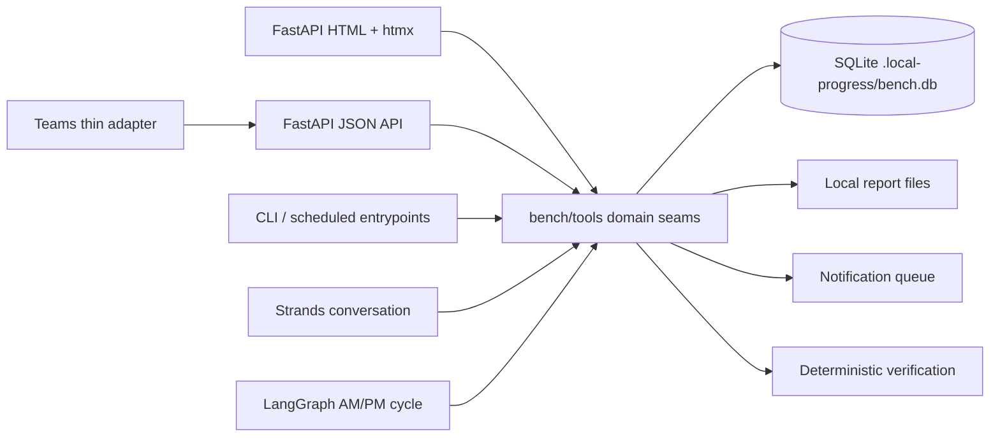

# Bench UI architecture spine

## Paradigm

Thin channels over a deterministic domain-tool core, with projection-oriented server-rendered UI.
FastAPI owns HTTP composition, HTML pages, JSON contracts, and htmx fragment responses. Domain
mutations and reads belong to `bench/tools`; SQLite is the local source of truth. Strands remains
the conversational engine and LangGraph remains the fixed daily-cycle engine.



## Inherited invariants

These decisions are ratified from `BENCH_SPEC.md`, `ARCHITECTURE.md`, and ADRs 0001–0004.

### AD-1 — Bench remains a parallel domain [ADOPTED]

- **Binds:** Bench code, data, and UI remain isolated under the Bench domain on `feature/bench`.
- **Prevents:** UI work changing the onboarding workshop's YAML domain or silently merging two data contracts.
- **Rule:** Bench-specific catalog/state uses SQLite and `bench/tools`; onboarding YAML remains outside this slice.

### AD-2 — SQLite owns local Bench truth [ADOPTED]

- **Binds:** Profiles/roles, permissions context, tracks, tasks, task contacts, responsibles, people, person-task state, check-ins, knowledge, conversation references, notifications, and the new audit log are persisted in SQLite.
- **Prevents:** shadow YAML, UI-only state, or generated Markdown becoming authoritative.
- **Rule:** A successful mutation is committed to SQLite before its page, fragment, report, or notification projection is returned.

### AD-3 — Catalog templates and person instances stay separate [ADOPTED]

- **Binds:** `tasks` are track templates; `person_tasks` own per-person status, evidence, notes, and timestamps.
- **Prevents:** editing a catalog task changing historical completion for every person, or completion being stored on a shared template.
- **Rule:** Catalog task edits affect future and explicitly reconciled assignments; existing person history remains readable and attributable.

### AD-4 — Hybrid orchestration remains explicit [ADOPTED]

- **Binds:** Strands handles open-ended conversation; LangGraph handles the fixed AM/PM pipeline; verification and state writes are deterministic tools.
- **Prevents:** an LLM improvising goal completion, approval, notification delivery, or catalog facts.
- **Rule:** UI/API mutations call deterministic tools directly; generated prose is a read-only summary of verified state.

### AD-5 — Channels are thin [ADOPTED]

- **Binds:** web UI, JSON API, Teams, CLI, and scheduled entrypoints share domain-tool seams.
- **Prevents:** route handlers, Teams code, or templates becoming alternate owners of business rules or persistence.
- **Rule:** Any behavior needed by more than one channel is implemented in `bench/tools` or a storage seam, then projected by each channel.

### AD-6 — Access is simulated and profile-owned [ADOPTED]

- **Binds:** profile/role records define permissions and approval-required actions; tracks only reference profiles.
- **Prevents:** AI text, knowledge suggestions, tracks, or the local UI granting or claiming sensitive access.
- **Rule:** The local surface may display only `not_required`, `approval_required`, or `pending_simulated`; it never provisions access or claims an unqualified granted state.

### AD-7 — Plans and reports are immutable projections [ADOPTED]

- **Binds:** plan and EOD report Markdown is generated from catalog and verified state, saved locally, and rendered read-only.
- **Prevents:** editing rendered prose mutating tasks, permissions, approval state, or audit history.
- **Rule:** Report recipient and delivery metadata are displayed outside the Markdown projection.

## Required architecture changes for UI completion

### AD-8 — Person lifecycle is explicit and distinct from date status

- **Binds:** a person has a durable lifecycle/archive state, while `inactive`, `pre_bench`, and `active` remain derived from `bench_start_date`.
- **Prevents:** archive being confused with inactivity, archived people disappearing permanently, or date changes rewriting history.
- **Rule:** Active dashboard/review queries exclude archived people by default; an archive view can restore/read them. Archive preserves person tasks, check-ins, reports, notifications, and audit history. Person edit and archive operations are tool-level mutations.

### AD-9 — Every mutation has an explicit local actor and audit record

- **Binds:** all catalog, person, task, check-in, report-trigger, date, lifecycle, approval-display, and notification-status mutations record actor, timestamp, entity/type and id, action, outcome, and target context.
- **Prevents:** unexplainable backoffice changes and UI/API paths with different audit behavior.
- **Rule:** The local actor is read from `BENCH_ACTOR`, defaults to the visible value `local-operator`, and is exposed in the local UI context; tests may override it. Audit append is part of the same SQLite transaction as the mutation where possible; failed mutations record an outcome only if the failure can be persisted without masking the original error.

### AD-10 — Report and notification status are separate state machines

- **Binds:** report generation exposes durable local save status; notification state exposes recipient, queued/pending, delivered, and delivery timestamp/error independently.
- **Prevents:** “saved” being presented as “sent,” or a queued Teams message being presented as delivered.
- **Rule:** Each projection reads the underlying report/notification records and uses explicit copy such as `Report saved locally` and `Notification pending`.

### AD-11 — UI mutations have one predictable response contract

- **Binds:** full-page creates and person-level mutations use POST → 303 → canonical page; inline row edits/deletes return only the stable targeted fragment.
- **Prevents:** duplicate submissions, stale unrelated rows, and htmx responses that cannot be safely swapped.
- **Rule:** Every inline target has a stable id; successful save returns read mode; cancel re-reads the original row; failure retains entered values and returns an associated error fragment; no mutation relies on a client-side optimistic state.

### AD-12 — Navigation owns discoverability

- **Binds:** Dashboard, Review, Onboard, Roles, Tracks, and AI Knowledge are persistent navigation destinations; tasks and responsibles are reached from Track detail.
- **Prevents:** stories introducing undocumented routes or catalog surfaces that only work by URL knowledge.
- **Rule:** A new operator surface must have a nav link or a documented parent action, and the current location must be perceivable.

### AD-13 — Catalog safety is dependency-aware

- **Binds:** role/track deletion checks assignments; responsible edit/remove is first-class; task changes preserve person history; destructive actions are confirmed and audited.
- **Prevents:** orphaned assignments, silent cascades, and “delete and recreate” losing recipient or audit meaning.
- **Rule:** Refused deletion returns the record with a human-readable dependency reason. A task may be physically deleted only before it has been instantiated for a person; after instantiation it is archived/inactivated and its historical identity is retained. Responsible identity is unique by case-insensitive `(track_id, email)` while the same responsible may serve multiple tracks.

### AD-14 — Accessibility and responsive behavior are architecture acceptance invariants

- **Binds:** semantic tables/forms/dialogs, visible labels, accessible action names, keyboard-complete flows, visible focus, text-plus-color status, associated validation, announced htmx feedback, 200% zoom readability, and small-screen table scrolling.
- **Prevents:** parallel stories treating accessibility as optional styling or relying on hover/color-only behavior.
- **Rule:** Native HTML remains the baseline; htmx enhances it and must not be required for the primary mutation flow to be understandable.

### AD-15 — Storage replacement is behind the tool seam

- **Binds:** UI and API consume domain-shaped operations and stable identifiers; SQLite connection/schema details stay in `bench/db.py` and tool/storage code.
- **Prevents:** a future DynamoDB migration leaking condition expressions, partition keys, or eventual-consistency assumptions into templates/routes.
- **Rule:** New UI behavior must be expressible through the same tool contract used by API/Teams; a later `BENCH_STORAGE=sqlite|dynamodb` choice changes the adapter, not the channel contract.

## Minimum implementation shape

The following is seed, not a second schema specification. Names may follow existing conventions, but
the ownership and transactional rules above are fixed.

```text
db.py
  people: lifecycle/archive fields
  audit_log: actor, at, entity, entity_id, action, outcome, context
  reports or report index: person/date/path/status (if file scan is insufficient)
  notifications: recipient + pending/delivered/error projection

bench/tools
  people: list/get/update/archive/restore with dependency validation
  catalog: update_responsible; safe task deletion/history handling
  audit: append/list action history
  reports/notify: status queries and explicit local delivery state
  approval projection: read-only simulated state from profile/task facts

bench/webapp.py
  persistent Tracks navigation
  person lifecycle and action-history surfaces
  explicit simulated approval and report/notification statuses
  stable htmx fragments with accessible feedback
```

The web layer must not call SQLite directly to implement these behaviors. Existing deterministic
verification, date-triggered notification evaluation, report generation, and API token behavior stay
intact while their mutations gain the shared actor/audit context.

## Reconciled requirements and UX coverage

| Requirement | Architectural landing |
|---|---|
| Discoverable navigation | AD-12 |
| People create/edit/archive lifecycle | AD-8, AD-13 |
| Roles, tracks, tasks, knowledge, responsibles CRUD | AD-2, AD-3, AD-13 |
| Inline editing and htmx fragments | AD-11 |
| Progress, check-ins, reports | AD-4, AD-7, AD-10 |
| Notification status | AD-10 |
| Simulated approval visibility | AD-6 plus approval projection seam |
| Audit history and actor identity | AD-9 |
| Accessibility and responsive behavior | AD-14 |
| SQLite/local boundary | AD-1, AD-2 |
| Future API/DynamoDB/AWS path | AD-4, AD-5, AD-15 |

## Deferred future architecture

These are deliberately not required to complete the local UI:

- Hosted authentication, authorization, employee information filtering, and a multi-tenant backoffice.
- Real IAM Identity Center, Git provider, LMS, Teams delivery guarantees, or any other provisioning.
- AWS deployment, AgentCore Runtime hosting, EventBridge scheduling, managed secrets, and production observability.
- DynamoDB table/key design and migration execution; only the adapter seam is fixed here.
- Bedrock Knowledge Base/RAG for profile documentation and repo-feedback automation.
- Production retention/deletion policy, permission-template review workflow, and security ownership.

## Resolved decisions before stories

The five decisions identified during ratification are resolved as follows:

1. **Local actor source:** `BENCH_ACTOR`, defaulting to visible `local-operator`; tests may override it.
2. **Person removal:** archive-only in the UI; reports, tasks, notifications, and audit history are preserved.
3. **Simulated approval vocabulary:** `not_required`, `approval_required`, and `pending_simulated`; no state or copy claims granted access.
4. **Responsible identity:** unique by case-insensitive `(track_id, email)`; one responsible may be attached to multiple tracks.
5. **Task deletion history policy:** physical deletion is allowed only before person instantiation; instantiated tasks are archived/inactivated and historical identity is retained.

No hosted identity, real provisioning, AWS deployment, or multi-tenant decision is a blocker for this
UI completion slice; those remain future architecture.

## Amendments

- `docs/ARCHITECTURE.md`: amend to distinguish the Bench SQLite/local architecture from the older YAML onboarding sketch, and state the localhost trust boundary and tool/API/DynamoDB seam.
- `docs/adr/0003-relational-catalog-sqlite.md`: amend for lifecycle/archive, audit ownership, notification/report records, and preservation of person history when catalog items change.
- `docs/adr/0004-teams-bot-thin-channel.md`: amend to state that actor context and report/notification status remain service-owned across web/API/Teams, with no channel-local interpretation.
- `docs/adr/0001-bench-as-parallel-domain.md`: retain, but clarify that “tracks/ data dir” is historical and SQLite is now authoritative; resolve the duplicate/ambiguous ADR numbering or title references to ADR 0004.
- `docs/ux-dayone-bench/EXPERIENCE.md`: no semantic conflict; use AD-8 through AD-14 as implementation constraints and add the final actor/approval vocabulary once decisions 1 and 3 are made.

## Technology reality check

The architecture relies only on behavior already present in the repository and documented by current
primary references: htmx supports targeted `hx-target`/`hx-swap` fragment updates and distinguishes
fragment responses from redirect behavior; LangGraph continues to model explicit state/nodes/edges;
SQLite provides transactional local persistence. The spine does not bind a new framework or a new
version, so future dependency upgrades must preserve these contracts.

References: [htmx documentation](https://htmx.org/docs/), [htmx `hx-target`](https://htmx.org/attributes/hx-target/), [LangGraph Graph API](https://docs.langchain.com/oss/python/langgraph/graph-api), [SQLite documentation](https://sqlite.org/docs.html).
